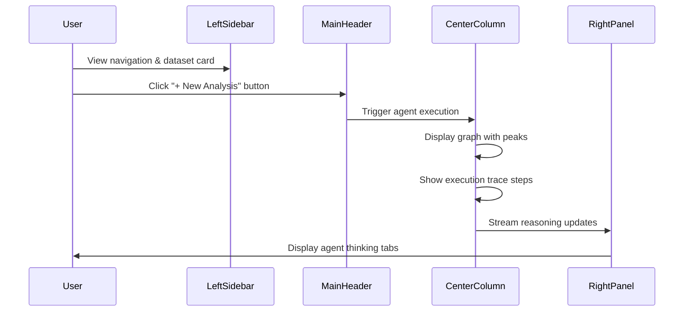
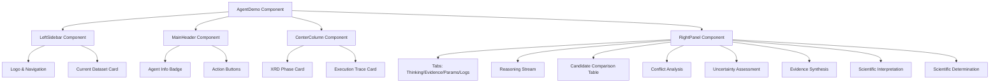

# Design Document: Agent Demo v3.1 Visual Transformation

## Overview

Transform the AgentDemo.tsx page from a single-column layout with top controls to a three-column v3.1 reference UI design featuring a left navigation sidebar, center content area with graph and execution trace cards, and right panel for agent thinking. This is a visual and rendering transformation only—no changes to routing, dataset logic, graph data sources, or button handlers.

## Main Algorithm/Workflow



## Architecture



## Core Interfaces/Types

```typescript
// Component Props
interface LeftSidebarProps {
  currentDataset: DemoDataset;
  currentProject: DemoProject;
  onNavigate: (route: string) => void;
}

interface MainHeaderProps {
  agentVersion: string;
  executionStatus: 'idle' | 'running' | 'complete';
  modelMode: ModelMode;
  onNewAnalysis: () => void;
  onExportReport: () => void;
}

interface CenterColumnProps {
  context: AgentContext;
  dataset: DemoDataset;
  project: DemoProject;
  graphData: DataPoint[];
  peakMarkers?: DemoPeak[];
  baselineData?: DataPoint[];
  executionSteps: ExecutionStep[];
  progressPercent: number;
  metrics: MetricCard[];
}

interface RightPanelProps {
  activeTab: 'thinking' | 'evidence' | 'parameters' | 'logs';
  currentStep: number;
  totalSteps: number;
  reasoningStream: ReasoningStreamData;
  candidates: CandidateData[];
  conflictAnalysis: ConflictData;
  uncertaintyAssessment: UncertaintyData;
  evidenceSynthesis: EvidenceData;
  scientificInterpretation: InterpretationData;
  scientificDetermination: DeterminationData;
  onTabChange: (tab: string) => void;
}

// Data Structures
interface ExecutionStep {
  number: number;
  title: string;
  description: string;
  tool: string;
  time: string;
  status: 'pending' | 'running' | 'complete' | 'error';
}

interface MetricCard {
  label: string;
  value: string;
  sublabel?: string;
}

interface CandidateData {
  phase: string;
  peakAlignment: string;
  intensityCorr: string;
  completeness: string;
  score: string;
  result: 'Match' | 'Rejected';
  reason?: string;
}

interface ReasoningStreamData {
  step: string;
  observedPeaks: string[];
  evaluationLogic: string[];
}
```

## Key Functions with Formal Specifications

### Function 1: renderLeftSidebar()

```typescript
function renderLeftSidebar(
  currentDataset: DemoDataset,
  currentProject: DemoProject,
  onNavigate: (route: string) => void
): JSX.Element
```

**Preconditions:**
- `currentDataset` is non-null and contains valid dataset metadata
- `currentProject` is non-null and contains valid project information
- `onNavigate` is a valid callback function

**Postconditions:**
- Returns JSX element containing logo, navigation items, and dataset card
- Navigation items include: Agent Demo (active), Workflows, Data, Results, Knowledge, Settings
- Dataset card displays: filename, technique, range, step size, points, status, "View Dataset" button
- All navigation items are clickable and call `onNavigate` with appropriate route

**Loop Invariants:** N/A

### Function 2: renderMainHeader()

```typescript
function renderMainHeader(
  agentVersion: string,
  executionStatus: RunStatus,
  modelMode: ModelMode,
  onNewAnalysis: () => void,
  onExportReport: () => void
): JSX.Element
```

**Preconditions:**
- `agentVersion` is non-empty string (e.g., "v0.1")
- `executionStatus` is one of: 'idle', 'running', 'complete'
- `modelMode` is one of: 'deterministic', 'vertex-gemini', 'gemma'
- `onNewAnalysis` and `onExportReport` are valid callback functions

**Postconditions:**
- Returns compact header JSX element
- Left side displays: "DIFARYX Agent {version}", "Autonomous Scientific Agent", "LIVE EXECUTION" badge
- Right side displays: "Hybrid Reasoning: Deterministic + Gemini", "+ New Analysis" button, "Export Report" button
- Buttons are disabled when `executionStatus === 'running'`
- "LIVE EXECUTION" badge is visible only when `executionStatus === 'running'`

**Loop Invariants:** N/A

### Function 3: renderCenterColumn()

```typescript
function renderCenterColumn(
  context: AgentContext,
  dataset: DemoDataset,
  project: DemoProject,
  graphData: DataPoint[],
  peakMarkers: DemoPeak[] | undefined,
  baselineData: DataPoint[] | undefined,
  executionSteps: ExecutionStep[],
  progressPercent: number,
  metrics: MetricCard[]
): JSX.Element
```

**Preconditions:**
- `context` is valid AgentContext ('XRD', 'XPS', 'FTIR', 'Raman')
- `dataset` contains valid dataPoints array
- `graphData` is non-empty array of DataPoint objects
- `executionSteps` is array of 7 ExecutionStep objects
- `progressPercent` is number between 0 and 100
- `metrics` is array of 4 MetricCard objects

**Postconditions:**
- Returns JSX element with two cards: XRD Phase Identification and Execution Trace
- Card 1 contains: title with badge, graph (always visible), 4 metric cards below graph
- Card 2 contains: vertical step list (7 steps), each with number, title, description, tool chip, time, status icon
- Progress bar at bottom shows `progressPercent`
- Peak markers are visible on graph after execution starts
- Graph uses existing Graph component with same data sources

**Loop Invariants:**
- For each step in executionSteps: step.number is sequential from 1 to 7
- All metric cards maintain consistent styling based on their data

### Function 4: renderRightPanel()

```typescript
function renderRightPanel(
  activeTab: string,
  currentStep: number,
  totalSteps: number,
  reasoningStream: ReasoningStreamData,
  candidates: CandidateData[],
  conflictAnalysis: ConflictData,
  uncertaintyAssessment: UncertaintyData,
  evidenceSynthesis: EvidenceData,
  scientificInterpretation: InterpretationData,
  scientificDetermination: DeterminationData,
  onTabChange: (tab: string) => void
): JSX.Element
```

**Preconditions:**
- `activeTab` is one of: 'thinking', 'evidence', 'parameters', 'logs'
- `currentStep` is number between 0 and `totalSteps`
- `totalSteps` is positive integer (typically 6)
- All data objects are non-null (may be empty)
- `onTabChange` is valid callback function

**Postconditions:**
- Returns JSX element with tab navigation and content area
- Tabs: Agent Thinking | Evidence | Parameters | Logs
- When activeTab === 'thinking', displays 8 sections in order:
  1. REASONING STREAM (step indicator, observed peaks, evaluation logic)
  2. CANDIDATE COMPARISON (table with 3 candidates)
  3. CONFLICT ANALYSIS
  4. UNCERTAINTY ASSESSMENT
  5. EVIDENCE SYNTHESIS (IN PROGRESS) with formula
  6. SCIENTIFIC INTERPRETATION [Source: Gemini]
  7. SCIENTIFIC DETERMINATION (PENDING FINALIZATION) [Source: Hybrid]
- Content scrolls independently from tabs
- Tab changes call `onTabChange` with new tab name

**Loop Invariants:**
- For each candidate in candidates: all required fields are present
- Section order remains consistent throughout execution

## Algorithmic Pseudocode

### Main Layout Transformation Algorithm

```pascal
ALGORITHM transformAgentDemoLayout(currentState)
INPUT: currentState of type AgentDemoState
OUTPUT: JSX element with v3.1 three-column layout

BEGIN
  ASSERT currentState is valid and non-null
  
  // Step 1: Extract current data from state
  dataset ← getDatasetOption(currentState.context, currentState.datasetId)
  executionSteps ← mapStagesToExecutionSteps(currentState.toolTrace)
  progressPercent ← calculateProgress(currentState.reasoningState.currentStepIndex)
  
  // Step 2: Build left sidebar
  leftSidebar ← renderLeftSidebar(
    dataset.dataset,
    dataset.project,
    handleNavigate
  )
  
  // Step 3: Build main header
  mainHeader ← renderMainHeader(
    "v0.1",
    currentState.reasoningState.status,
    currentState.modelMode,
    handlePrimaryRun,
    handleExportReport
  )
  
  // Step 4: Build center column with cards
  centerColumn ← renderCenterColumn(
    currentState.context,
    dataset.dataset,
    dataset.project,
    dataset.dataset.dataPoints,
    currentState.graphState.showMarkers ? peakMarkers : undefined,
    baselineData,
    executionSteps,
    progressPercent,
    currentState.reasoningState.result?.metrics ?? defaultMetrics
  )
  
  // Step 5: Build right panel with tabs
  rightPanel ← renderRightPanel(
    "thinking",
    currentState.reasoningState.currentStepIndex,
    CONTEXT_CONFIG[currentState.context].stages.length,
    extractReasoningStream(currentState),
    extractCandidates(currentState),
    extractConflictAnalysis(currentState),
    extractUncertaintyAssessment(currentState),
    extractEvidenceSynthesis(currentState),
    extractScientificInterpretation(currentState),
    extractScientificDetermination(currentState),
    handleTabChange
  )
  
  // Step 6: Compose three-column layout
  layout ← createThreeColumnLayout(
    leftSidebar,
    mainHeader,
    centerColumn,
    rightPanel
  )
  
  ASSERT layout is valid JSX element
  
  RETURN layout
END
```

**Preconditions:**
- currentState is valid AgentDemoState object
- All required data is available in currentState
- All handler functions are defined and accessible

**Postconditions:**
- Returns complete JSX element with three-column layout
- Left sidebar is 280px wide, fixed
- Center column is flexible width
- Right panel is 400px wide, fixed
- Layout is responsive (stacks on mobile)
- All existing functionality is preserved

**Loop Invariants:**
- State transformations maintain data integrity
- No data sources are modified during rendering

### Execution Step Mapping Algorithm

```pascal
ALGORITHM mapStagesToExecutionSteps(toolTrace)
INPUT: toolTrace array of ToolTraceEntry objects
OUTPUT: executionSteps array of ExecutionStep objects

BEGIN
  ASSERT toolTrace is non-null array
  ASSERT toolTrace.length = 7
  
  executionSteps ← empty array
  
  FOR each entry IN toolTrace DO
    ASSERT entry has all required fields
    
    step ← {
      number: index + 1,
      title: entry.displayName,
      description: entry.inputSummary,
      tool: entry.toolName,
      time: entry.durationMs / 1000 + "s",
      status: entry.status
    }
    
    executionSteps.add(step)
  END FOR
  
  ASSERT executionSteps.length = 7
  ASSERT all steps have sequential numbers 1-7
  
  RETURN executionSteps
END
```

**Preconditions:**
- toolTrace is array of exactly 7 ToolTraceEntry objects
- Each entry has displayName, inputSummary, toolName, durationMs, status fields

**Postconditions:**
- Returns array of exactly 7 ExecutionStep objects
- Steps are numbered sequentially from 1 to 7
- All required fields are populated
- Time is formatted as seconds with "s" suffix

**Loop Invariants:**
- Each iteration adds exactly one step to executionSteps
- Step numbers are sequential and match iteration index + 1

### Progress Calculation Algorithm

```pascal
ALGORITHM calculateProgress(currentStepIndex)
INPUT: currentStepIndex of type number
OUTPUT: progressPercent of type number

BEGIN
  totalSteps ← 7
  
  IF currentStepIndex < 0 THEN
    RETURN 0
  END IF
  
  IF currentStepIndex >= totalSteps THEN
    RETURN 100
  END IF
  
  progressPercent ← ((currentStepIndex + 1) / totalSteps) * 100
  progressPercent ← round(progressPercent)
  
  ASSERT progressPercent >= 0 AND progressPercent <= 100
  
  RETURN progressPercent
END
```

**Preconditions:**
- currentStepIndex is integer (may be negative for idle state)

**Postconditions:**
- Returns integer between 0 and 100 (inclusive)
- 0 when no steps completed
- 100 when all steps completed
- Proportional value for partial completion

**Loop Invariants:** N/A

## Example Usage

```typescript
// Example 1: Rendering the transformed layout
function AgentDemo() {
  const [agentState, setAgentState] = useState<AgentDemoState>(() =>
    makeInitialState(searchParams.get('project'))
  );
  
  // Existing state and handlers remain unchanged
  
  return (
    <div className="flex h-screen bg-[#070B12]">
      {/* Left Sidebar - NEW */}
      <LeftSidebar
        currentDataset={selectedDataset}
        currentProject={selectedProject}
        onNavigate={handleNavigate}
      />
      
      {/* Main Content Area */}
      <div className="flex flex-1 flex-col min-w-0">
        {/* Main Header - NEW (replaces old header + controls) */}
        <MainHeader
          agentVersion="v0.1"
          executionStatus={agentState.reasoningState.status}
          modelMode={agentState.modelMode}
          onNewAnalysis={handlePrimaryRun}
          onExportReport={handleExportReport}
        />
        
        {/* Center Column - TRANSFORMED */}
        <div className="flex flex-1 min-h-0">
          <CenterColumn
            context={agentState.context}
            dataset={selectedDataset}
            project={selectedProject}
            graphData={selectedDataset.dataPoints}
            peakMarkers={peakMarkers}
            baselineData={baselineData}
            executionSteps={executionSteps}
            progressPercent={progressPercent}
            metrics={currentResult?.metrics ?? defaultMetrics}
          />
          
          {/* Right Panel - NEW */}
          <RightPanel
            activeTab={activeTab}
            currentStep={agentState.reasoningState.currentStepIndex}
            totalSteps={stages.length}
            reasoningStream={reasoningStream}
            candidates={candidates}
            conflictAnalysis={conflictAnalysis}
            uncertaintyAssessment={uncertaintyAssessment}
            evidenceSynthesis={evidenceSynthesis}
            scientificInterpretation={scientificInterpretation}
            scientificDetermination={scientificDetermination}
            onTabChange={setActiveTab}
          />
        </div>
      </div>
    </div>
  );
}

// Example 2: Left Sidebar Component
function LeftSidebar({ currentDataset, currentProject, onNavigate }: LeftSidebarProps) {
  return (
    <aside className="w-[280px] shrink-0 border-r border-slate-800/50 bg-[#080E19] flex flex-col">
      {/* Logo */}
      <div className="h-16 flex items-center px-6 border-b border-slate-800/50">
        <span className="text-xl font-bold text-white">DIFARYX</span>
      </div>
      
      {/* Navigation */}
      <nav className="flex-1 p-4 space-y-1">
        <NavItem icon={Activity} label="Agent Demo" active onClick={() => onNavigate('/demo/agent')} />
        <NavItem icon={Layers} label="Workflows" onClick={() => onNavigate('/workflows')} />
        <NavItem icon={Database} label="Data" onClick={() => onNavigate('/data')} />
        <NavItem icon={FileText} label="Results" onClick={() => onNavigate('/results')} />
        <NavItem icon={Brain} label="Knowledge" onClick={() => onNavigate('/knowledge')} />
        <NavItem icon={Settings} label="Settings" onClick={() => onNavigate('/settings')} />
      </nav>
      
      {/* Current Dataset Card */}
      <div className="p-4 border-t border-slate-800/50">
        <DatasetCard dataset={currentDataset} project={currentProject} />
      </div>
    </aside>
  );
}

// Example 3: Center Column with Cards
function CenterColumn({ context, dataset, graphData, peakMarkers, executionSteps, progressPercent, metrics }: CenterColumnProps) {
  return (
    <div className="flex-1 overflow-y-auto p-6 space-y-6">
      {/* Card 1: XRD Phase Identification */}
      <div className="rounded-lg border border-slate-800 bg-[#0F172A] p-6">
        <div className="flex items-center justify-between mb-4">
          <h2 className="text-lg font-bold text-white">XRD Phase Identification</h2>
          <span className="px-3 py-1 rounded-full bg-emerald-400/10 border border-emerald-400/30 text-emerald-300 text-xs font-bold">
            Signal Loaded
          </span>
        </div>
        
        {/* Graph - Always Visible */}
        <div className="h-[400px] rounded border border-slate-800 bg-[#070B12] p-4 mb-4">
          <Graph
            type="xrd"
            height="100%"
            externalData={graphData}
            peakMarkers={peakMarkers}
            showBackground={true}
          />
        </div>
        
        {/* Four Metric Cards */}
        <div className="grid grid-cols-4 gap-4">
          {metrics.map((metric) => (
            <MetricCard key={metric.label} {...metric} />
          ))}
        </div>
      </div>
      
      {/* Card 2: Execution Trace */}
      <div className="rounded-lg border border-slate-800 bg-[#0F172A] p-6">
        <h2 className="text-lg font-bold text-white mb-4">Execution Trace</h2>
        
        {/* Vertical Step List */}
        <div className="space-y-3">
          {executionSteps.map((step) => (
            <ExecutionStepItem key={step.number} {...step} />
          ))}
        </div>
        
        {/* Progress Bar */}
        <div className="mt-6">
          <div className="flex items-center justify-between mb-2">
            <span className="text-xs font-bold text-slate-400">EXECUTION PROGRESS</span>
            <span className="text-xs font-bold text-cyan-300">{progressPercent}%</span>
          </div>
          <div className="h-2 rounded-full bg-slate-800 overflow-hidden">
            <div
              className="h-full bg-gradient-to-r from-cyan-400 to-blue-500 transition-all duration-300"
              style={{ width: `${progressPercent}%` }}
            />
          </div>
        </div>
      </div>
    </div>
  );
}
```

## Correctness Properties

### Universal Quantification Statements

1. **Layout Integrity**: ∀ state ∈ AgentDemoState, renderLayout(state) produces valid three-column layout with left sidebar (280px), center column (flexible), right panel (400px)

2. **Data Preservation**: ∀ transformation ∈ LayoutTransformations, transformation preserves all existing data sources and does not modify graph data, dataset logic, or button handlers

3. **Component Isolation**: ∀ component ∈ {LeftSidebar, MainHeader, CenterColumn, RightPanel}, component can be rendered independently without affecting other components

4. **Execution Step Mapping**: ∀ toolTrace ∈ ToolTraceEntry[], mapStagesToExecutionSteps(toolTrace) produces exactly 7 ExecutionStep objects with sequential numbering

5. **Progress Calculation**: ∀ stepIndex ∈ [-1, 7], calculateProgress(stepIndex) returns value in range [0, 100]

6. **Responsive Behavior**: ∀ viewport width < 1024px, layout stacks vertically (left sidebar → main header → center column → right panel)

7. **Graph Visibility**: ∀ executionState ∈ {idle, running, complete}, graph remains visible and does not collapse

8. **Peak Marker Timing**: ∀ stepIndex ≥ 1, peak markers are visible on graph when context === 'XRD'

9. **Status Consistency**: ∀ step ∈ ExecutionSteps, step.status ∈ {pending, running, complete, error} and status transitions are monotonic (pending → running → complete/error)

10. **Tab Navigation**: ∀ tab ∈ {thinking, evidence, parameters, logs}, clicking tab updates activeTab state and displays corresponding content

## Error Handling

### Error Scenario 1: Missing Dataset

**Condition**: currentDataset is null or undefined
**Response**: Display placeholder card in left sidebar with "No dataset loaded" message
**Recovery**: Allow user to select dataset from dropdown in main header

### Error Scenario 2: Invalid Execution Step Data

**Condition**: toolTrace array length ≠ 7 or missing required fields
**Response**: Log error to console, display generic 7-step template with "Loading..." status
**Recovery**: Retry data extraction on next state update

### Error Scenario 3: Graph Rendering Failure

**Condition**: Graph component throws error or graphData is empty
**Response**: Display error boundary with "Graph unavailable" message and retry button
**Recovery**: Preserve all other UI elements, allow user to retry or continue without graph

### Error Scenario 4: Responsive Layout Overflow

**Condition**: Viewport width < 280px (minimum sidebar width)
**Response**: Hide left sidebar, show hamburger menu icon in main header
**Recovery**: Sidebar becomes overlay drawer, accessible via hamburger menu

## Testing Strategy

### Unit Testing Approach

**Test Suite 1: Component Rendering**
- Test LeftSidebar renders with correct navigation items
- Test MainHeader displays correct agent version and status badges
- Test CenterColumn renders both cards with correct content
- Test RightPanel renders all 8 sections in Agent Thinking tab
- Test each component handles missing/null props gracefully

**Test Suite 2: Data Transformation**
- Test mapStagesToExecutionSteps with valid 7-step toolTrace
- Test mapStagesToExecutionSteps with invalid input (wrong length, missing fields)
- Test calculateProgress with various stepIndex values (-1, 0, 3, 6, 7, 10)
- Test extractReasoningStream, extractCandidates, etc. with valid and empty state

**Test Suite 3: Event Handlers**
- Test navigation handler calls onNavigate with correct route
- Test "+ New Analysis" button calls handlePrimaryRun
- Test "Export Report" button calls handleExportReport
- Test tab change handler updates activeTab state
- Test all handlers are disabled during execution (status === 'running')

### Property-Based Testing Approach

**Property Test Library**: fast-check (TypeScript/JavaScript)

**Property 1: Layout Dimensions**
```typescript
fc.assert(
  fc.property(fc.record({
    context: fc.constantFrom('XRD', 'XPS', 'FTIR', 'Raman'),
    datasetId: fc.string(),
    status: fc.constantFrom('idle', 'running', 'complete')
  }), (state) => {
    const layout = renderLayout(state);
    const leftSidebar = layout.querySelector('.left-sidebar');
    const rightPanel = layout.querySelector('.right-panel');
    
    expect(leftSidebar.offsetWidth).toBe(280);
    expect(rightPanel.offsetWidth).toBe(400);
  })
);
```

**Property 2: Execution Steps Always 7**
```typescript
fc.assert(
  fc.property(fc.array(fc.record({
    id: fc.string(),
    displayName: fc.string(),
    inputSummary: fc.string(),
    toolName: fc.string(),
    durationMs: fc.nat(),
    status: fc.constantFrom('pending', 'running', 'complete', 'error')
  }), { minLength: 7, maxLength: 7 }), (toolTrace) => {
    const steps = mapStagesToExecutionSteps(toolTrace);
    expect(steps.length).toBe(7);
    expect(steps.map(s => s.number)).toEqual([1, 2, 3, 4, 5, 6, 7]);
  })
);
```

**Property 3: Progress Monotonicity**
```typescript
fc.assert(
  fc.property(fc.integer({ min: -1, max: 7 }), fc.integer({ min: -1, max: 7 }), (step1, step2) => {
    const progress1 = calculateProgress(step1);
    const progress2 = calculateProgress(step2);
    
    if (step1 < step2) {
      expect(progress1).toBeLessThanOrEqual(progress2);
    }
  })
);
```

### Integration Testing Approach

**Integration Test 1: Full Layout Rendering**
- Render AgentDemo with mock state
- Verify all four major sections are present (sidebar, header, center, right panel)
- Verify graph is visible and receives correct data props
- Verify execution trace shows all 7 steps
- Verify right panel shows all 8 sections

**Integration Test 2: Execution Flow**
- Start with idle state
- Trigger "+ New Analysis" button
- Verify status changes to 'running'
- Verify execution steps update sequentially
- Verify progress bar advances
- Verify peak markers appear on graph after step 1
- Verify final state shows 'complete' status

**Integration Test 3: Responsive Behavior**
- Render layout at 1920px width (desktop)
- Verify three-column layout
- Resize to 1024px (tablet)
- Verify layout adjusts but maintains three columns
- Resize to 768px (mobile)
- Verify layout stacks vertically
- Verify left sidebar becomes drawer

## Performance Considerations

**Rendering Optimization**:
- Use React.memo for LeftSidebar, MainHeader, RightPanel (static content)
- Memoize executionSteps transformation with useMemo
- Memoize candidate data extraction with useMemo
- Avoid re-rendering Graph component unless graphData or peakMarkers change

**Layout Performance**:
- Use CSS Grid for center column cards (faster than flexbox for complex layouts)
- Use CSS transforms for progress bar animation (GPU-accelerated)
- Lazy load right panel sections (render only active tab content)
- Virtualize execution step list if > 20 steps (future-proofing)

**State Management**:
- Keep existing state structure (no refactoring)
- Add derived state for UI-only concerns (activeTab, sidebarOpen)
- Batch state updates during execution loop to minimize re-renders

## Security Considerations

**No security changes required** - this is a visual transformation only. All existing security patterns are preserved:
- No new API calls
- No new data sources
- No new authentication/authorization logic
- No new user input fields (except tab selection)

## Dependencies

**No new dependencies required**. All components use existing dependencies:
- React (existing)
- React Router (existing, for navigation)
- Lucide React (existing, for icons)
- Tailwind CSS (existing, for styling)
- Graph component (existing, no changes)

**Existing dependencies to preserve**:
- `src/components/ui/Graph.tsx` - used as-is
- `src/data/demoProjects.ts` - no changes
- `src/agents/xrdAgent.ts` - no changes
- All existing state management and handlers - no changes
