# Design Document: Scientific Accuracy Improvements

## Overview

This design addresses systematic scientific accuracy improvements across the DIFARYX demo application for copper ferrite (CuFe₂O₄) characterization. The application demonstrates autonomous scientific analysis using four complementary spectroscopic techniques: X-ray Diffraction (XRD), X-ray Photoelectron Spectroscopy (XPS), Fourier Transform Infrared Spectroscopy (FTIR), and Raman Spectroscopy.

### Current State

The DIFARYX application currently contains:
- XRD phase identification with synthetic pattern generation
- Multi-technique workspace interfaces (XPS, FTIR, Raman)
- Phase database with reference patterns
- Scientific reasoning engine for confidence calculations
- Synthetic trace generators for all four techniques

### Problem Statement

The current implementation contains scientifically inaccurate data that undermines the credibility of the demo:
1. **Chemical formula inconsistencies**: CuFe2O4 displayed without proper subscript formatting
2. **Inaccurate XRD peak positions**: Current peaks do not match JCPDS 25-0283 reference data
3. **Incorrect XPS binding energies**: Current values do not reflect correct Cu²⁺ and Fe³⁺ oxidation states
4. **Non-physical FTIR bands**: Current band positions do not correspond to metal-oxygen vibrations in spinel structure
5. **Incorrect Raman mode assignments**: Current modes lack proper symmetry labels (A₁g, Eg, T₂g)
6. **Missing crystallographic metadata**: Space group, lattice parameters, and structural information absent
7. **Unrealistic synthetic data**: Peak shapes, backgrounds, and intensity ratios do not match experimental patterns

### Design Goals

1. **Scientific Accuracy**: All spectroscopic parameters must match published literature values within experimental uncertainty
2. **Traceability**: All reference data must be traceable to authoritative sources (JCPDS/ICDD, peer-reviewed literature)
3. **Consistency**: Chemical formulas, oxidation states, and structural descriptions must be internally consistent
4. **Realism**: Synthetic spectroscopic data must include realistic features typical of experimental measurements
5. **Educational Value**: Technique descriptions and interpretations must follow established scientific reasoning

### Success Criteria

- All XRD peak positions match JCPDS 25-0283 within ±0.2°
- All XPS binding energies match literature values within ±0.5 eV
- All FTIR and Raman vibrational frequencies match literature values within typical experimental uncertainty
- Chemical formula CuFe₂O₄ displayed with proper subscript formatting throughout
- All Miller indices satisfy spinel structure systematic absences
- Synthetic data includes realistic backgrounds, noise, and peak shapes
- Confidence calculations based on sound scientific reasoning

## Architecture

### System Components

```mermaid
graph TD
    A[DIFARYX Application] --> B[Data Layer]
    A --> C[Synthetic Trace Generators]
    A --> D[Scientific Reasoning Engine]
    A --> E[UI Components]
    
    B --> B1[XRD Phase Database]
    B --> B2[XPS Reference Data]
    B --> B3[FTIR Reference Data]
    B --> B4[Raman Reference Data]
    
    C --> C1[XRD Pattern Generator]
    C --> C2[XPS Spectrum Generator]
    C --> C3[FTIR Spectrum Generator]
    C --> C4[Raman Spectrum Generator]
    
    D --> D1[Peak Detection]
    D --> D2[Phase Matching]
    D --> D3[Confidence Calculation]
    D --> D4[Interpretation Generation]
    
    E --> E1[Graph Components]
    E --> E2[Workspace Views]
    E --> E3[Landing Page]
    E --> E4[Agent Demo View]
```



### Data Flow

1. **Reference Data Loading**: Phase database and reference spectra loaded at application initialization
2. **Synthetic Data Generation**: Realistic spectroscopic patterns generated using reference peak positions and realistic backgrounds
3. **Peak Detection**: Automated peak detection algorithms identify features in synthetic data
4. **Phase Matching**: Detected peaks matched against reference database using position tolerance and intensity weighting
5. **Confidence Calculation**: Match quality assessed using scientific scoring criteria
6. **Interpretation Generation**: Human-readable scientific interpretations generated from match results

### Module Interactions

- **XRD Module** ↔ **Phase Database**: Retrieves reference peak positions, Miller indices, and relative intensities
- **XPS Module** ↔ **Reference Data**: Retrieves binding energies for Cu²⁺, Fe³⁺, and O²⁻ core levels
- **FTIR Module** ↔ **Reference Data**: Retrieves vibrational band positions for metal-oxygen bonds
- **Raman Module** ↔ **Reference Data**: Retrieves Raman-active mode positions and symmetry labels
- **Synthetic Generators** ↔ **All Modules**: Provides realistic spectroscopic data for demo workflows
- **Reasoning Engine** ↔ **All Modules**: Calculates confidence scores and generates interpretations

## Components and Interfaces

### 1. XRD Phase Database (`src/data/xrdPhaseDatabase.ts`)

**Purpose**: Store crystallographically accurate reference data for phase identification

**Current Interface**:
```typescript
interface XrdPhaseReference {
  id: string;
  name: string;
  formula: string;
  family: string;
  referenceNote: string;
  peaks: Array<{
    position: number;
    relativeIntensity: number;
    hkl: string;
  }>;
}
```

**Enhanced Interface**:
```typescript
interface XrdPhaseReference {
  id: string;
  name: string;
  formula: string;
  family: string;
  crystalSystem: 'cubic' | 'tetragonal' | 'hexagonal' | 'rhombohedral' | 'orthorhombic' | 'monoclinic' | 'triclinic';
  spaceGroup: string;
  latticeParameters: {
    a: number;
    b?: number;
    c?: number;
    alpha?: number;
    beta?: number;
    gamma?: number;
  };
  jcpdsCard?: string;
  icddPdf?: string;
  referenceNote: string;
  peaks: Array<{
    position: number;
    relativeIntensity: number;
    hkl: string;
    dSpacing: number;
  }>;
}
```

**Key Changes**:
- Add crystallographic metadata (crystal system, space group, lattice parameters)
- Add reference database identifiers (JCPDS card, ICDD PDF)
- Add calculated d-spacing for each peak
- Update CuFe₂O₄ peak positions to match JCPDS 25-0283

### 2. XRD Synthetic Pattern Generator (`src/data/xrdDemoDatasets.ts`)

**Purpose**: Generate realistic XRD patterns with accurate peak positions and realistic features

**Current Implementation**: Uses `pseudoVoigt` function with approximate peak positions

**Enhanced Implementation**:
- Use exact peak positions from updated phase database
- Implement Cu Kα₂ satellite peaks at +0.2° with 15-20% intensity
- Implement realistic exponentially decaying background
- Implement instrument broadening (peak width increases with 2θ)
- Add preferred orientation effects for (111) and (222) reflections

**Key Functions**:
```typescript
function synthesizeXrdPattern(options: SynthesisOptions): XrdPoint[]
function exponentialBackground(twoTheta: number): number
function instrumentBroadening(twoTheta: number, intrinsicWidth: number): number
function addKAlphaSatellites(peak: ReferencePeak, scale: number): number
```

### 3. XPS Reference Data (New Module: `src/data/xpsReferenceData.ts`)

**Purpose**: Store accurate binding energies for Cu²⁺, Fe³⁺, and O²⁻ core levels

**Interface**:
```typescript
interface XpsCoreLevelReference {
  element: string;
  oxidationState: string;
  coreLevel: string;
  bindingEnergy: number;
  uncertainty: number;
  fwhm: [number, number]; // [min, max] range
  spinOrbitSplitting?: number;
  satelliteOffset?: number;
  satelliteIntensity?: number;
  literatureSource: string;
}

const XPS_REFERENCE_DATA: XpsCoreLevelReference[] = [
  {
    element: 'Cu',
    oxidationState: '2+',
    coreLevel: '2p3/2',
    bindingEnergy: 933.5,
    uncertainty: 0.5,
    fwhm: [2.0, 3.0],
    spinOrbitSplitting: 19.8,
    satelliteOffset: 9.0,
    satelliteIntensity: 0.4,
    literatureSource: 'Biesinger et al., Surf. Interface Anal. 41, 324 (2009)'
  },
  // ... additional entries
];
```

### 4. XPS Synthetic Spectrum Generator (New Module: `src/data/xpsSpectrumGenerator.ts`)

**Purpose**: Generate realistic XPS spectra with accurate binding energies and peak shapes

**Key Features**:
- Gaussian-Lorentzian peak shapes with asymmetric tailing
- Shirley-type background increasing toward lower binding energy
- Satellite peaks for Cu²⁺ at appropriate offsets
- Spin-orbit doublets with correct intensity ratios (2:1 for p levels)
- Realistic peak widths (FWHM 2.0-3.5 eV)

**Key Functions**:
```typescript
function generateXpsSpectrum(region: XpsRegion, options: XpsOptions): SpectrumPoint[]
function shirleyBackground(points: SpectrumPoint[]): number[]
function gaussianLorentzian(x: number, center: number, fwhm: number, mixing: number): number
function addAsymmetricTail(peak: number[], tailFactor: number): number[]
```

### 5. FTIR Reference Data (New Module: `src/data/ftirReferenceData.ts`)

**Purpose**: Store accurate vibrational band positions for spinel metal-oxygen bonds

**Interface**:
```typescript
interface FtirBandReference {
  position: number;
  uncertainty: number;
  assignment: string;
  bondType: string;
  site: 'tetrahedral' | 'octahedral' | 'surface';
  fwhm: [number, number];
  literatureSource: string;
}

const FTIR_REFERENCE_DATA: FtirBandReference[] = [
  {
    position: 580,
    uncertainty: 20,
    assignment: 'Fe-O stretching (tetrahedral site)',
    bondType: 'metal-oxygen',
    site: 'tetrahedral',
    fwhm: [40, 80],
    literatureSource: 'Waldron, Phys. Rev. 99, 1727 (1955)'
  },
  // ... additional entries
];
```

### 6. FTIR Synthetic Spectrum Generator (`src/data/syntheticTraces.ts` - Enhanced)

**Purpose**: Generate realistic FTIR spectra with accurate band positions

**Key Features**:
- Accurate metal-oxygen stretching bands (400-700 cm⁻¹)
- Surface hydroxyl bands (3200-3600 cm⁻¹)
- Adsorbed water bending (1600-1650 cm⁻¹)
- Baseline drift typical of transmission measurements
- Realistic band widths (FWHM 40-100 cm⁻¹)

### 7. Raman Reference Data (New Module: `src/data/ramanReferenceData.ts`)

**Purpose**: Store accurate Raman-active mode positions with symmetry labels

**Interface**:
```typescript
interface RamanModeReference {
  position: number;
  uncertainty: number;
  symmetry: 'A1g' | 'Eg' | 'T2g';
  assignment: string;
  relativeIntensity: number;
  fwhm: [number, number];
  literatureSource: string;
}

const RAMAN_REFERENCE_DATA: RamanModeReference[] = [
  {
    position: 690,
    uncertainty: 10,
    symmetry: 'A1g',
    assignment: 'Symmetric stretching of oxygen in tetrahedral coordination',
    relativeIntensity: 100,
    fwhm: [15, 30],
    literatureSource: 'Graves et al., Mater. Res. Bull. 23, 1651 (1988)'
  },
  // ... additional entries
];
```

### 8. Raman Synthetic Spectrum Generator (`src/data/syntheticTraces.ts` - Enhanced)

**Purpose**: Generate realistic Raman spectra with accurate mode positions

**Key Features**:
- Five Raman-active modes: A₁g + Eg + 3T₂g
- Accurate mode positions (A₁g at 690 cm⁻¹, strongest)
- Fluorescence background typical of visible excitation
- Realistic band widths (FWHM 15-40 cm⁻¹)

### 9. Scientific Reasoning Engine (`src/agents/xrdAgent/` - Enhanced)

**Purpose**: Calculate confidence scores using scientifically sound criteria

**Current Implementation**: Basic match scoring

**Enhanced Implementation**:
- Weight strong peaks (relative intensity > 30) more heavily
- Apply position tolerance (±0.2° for XRD, ±0.5 eV for XPS)
- Penalize missing strong reference peaks
- Penalize unexplained observed peaks
- Flag ambiguity when multiple phases have similar scores
- Generate evidence-based interpretations with caveats

**Key Functions**:
```typescript
function calculatePhaseConfidence(matches: PeakMatch[], phase: PhaseReference): number
function penaltyForMissingStrongPeaks(phase: PhaseReference, matches: PeakMatch[]): number
function penaltyForUnexplainedPeaks(observedPeaks: Peak[], matches: PeakMatch[]): number
function generateScientificInterpretation(result: MatchResult): Interpretation
```

### 10. UI Components - Chemical Formula Rendering

**Purpose**: Display CuFe₂O₄ with proper subscript formatting

**Implementation Strategy**:
- Create utility function for chemical formula formatting
- Use HTML subscript tags or Unicode subscript characters
- Apply consistently across all UI components

**Utility Function**:
```typescript
function formatChemicalFormula(formula: string): string {
  // Convert CuFe2O4 → CuFe₂O₄
  return formula.replace(/(\d+)/g, (match) => {
    const subscripts = ['₀', '₁', '₂', '₃', '₄', '₅', '₆', '₇', '₈', '₉'];
    return match.split('').map(d => subscripts[parseInt(d)]).join('');
  });
}
```

## Data Models

### XRD Data Model

```typescript
// Reference phase with complete crystallographic information
interface XrdPhaseReference {
  id: string;
  name: string;
  formula: string;
  crystalSystem: CrystalSystem;
  spaceGroup: string;
  latticeParameters: LatticeParameters;
  jcpdsCard?: string;
  icddPdf?: string;
  peaks: XrdReferencePeak[];
}

interface XrdReferencePeak {
  position: number;        // 2θ in degrees
  relativeIntensity: number; // 0-100 scale
  hkl: string;            // Miller indices
  dSpacing: number;       // Å
}

// Observed XRD data point
interface XrdPoint {
  x: number;  // 2θ in degrees
  y: number;  // Intensity in arbitrary units
}

// Detected peak from pattern
interface DetectedPeak {
  id: string;
  position: number;
  intensity: number;
  fwhm: number;
  dSpacing: number;
  classification: 'sharp' | 'broad' | 'shoulder';
}
```

### XPS Data Model

```typescript
interface XpsCoreLevelReference {
  element: string;
  oxidationState: string;
  coreLevel: string;
  bindingEnergy: number;
  uncertainty: number;
  fwhm: [number, number];
  spinOrbitSplitting?: number;
  satelliteOffset?: number;
  satelliteIntensity?: number;
  literatureSource: string;
}

interface XpsSpectrumPoint {
  x: number;  // Binding energy in eV
  y: number;  // Counts in arbitrary units
}

interface XpsRegion {
  name: string;
  range: [number, number];  // [min, max] binding energy
  expectedPeaks: string[];  // Core level identifiers
}
```

### FTIR Data Model

```typescript
interface FtirBandReference {
  position: number;        // Wavenumber in cm⁻¹
  uncertainty: number;
  assignment: string;
  bondType: string;
  site: 'tetrahedral' | 'octahedral' | 'surface';
  fwhm: [number, number];
  literatureSource: string;
}

interface FtirSpectrumPoint {
  x: number;  // Wavenumber in cm⁻¹
  y: number;  // Transmittance in %
}
```

### Raman Data Model

```typescript
interface RamanModeReference {
  position: number;        // Raman shift in cm⁻¹
  uncertainty: number;
  symmetry: 'A1g' | 'Eg' | 'T2g';
  assignment: string;
  relativeIntensity: number;
  fwhm: [number, number];
  literatureSource: string;
}

interface RamanSpectrumPoint {
  x: number;  // Raman shift in cm⁻¹
  y: number;  // Intensity in arbitrary units
}
```

## Correctness Properties

*A property is a characteristic or behavior that should hold true across all valid executions of a system—essentially, a formal statement about what the system should do. Properties serve as the bridge between human-readable specifications and machine-verifiable correctness guarantees.*

### Assessment of Property-Based Testing Applicability

This feature involves updating **reference data**, **synthetic data generators**, and **UI formatting**—primarily configuration and data transformation tasks. The core changes are:

1. **Reference data updates**: Replacing numerical values in data files
2. **Synthetic data generation**: Mathematical functions that generate spectroscopic patterns
3. **UI formatting**: String transformation for chemical formulas
4. **Confidence calculations**: Scoring algorithms based on match quality

**PBT is appropriate for**:
- Synthetic data generation functions (mathematical properties)
- Chemical formula formatting (string transformation properties)
- Confidence calculation algorithms (scoring properties)

**PBT is NOT appropriate for**:
- Reference data accuracy (validated against literature, not generated)
- UI rendering (snapshot tests more appropriate)

Given the mixed nature of this feature, we will include property-based tests for the algorithmic components while using unit tests and validation tests for reference data accuracy.


### Property Reflection

After analyzing all 15 requirements with 80+ acceptance criteria, I've identified the following testable properties. Many criteria are configuration validation (EXAMPLE tests) rather than universal properties. The properties below represent the algorithmic and mathematical components that benefit from property-based testing:

**Redundancy Analysis:**
- Properties 2.1 and 10.2 both test peak position accuracy - can be combined
- Properties 2.7, 3.10, 4.5, 5.6 all test peak width ranges - can be combined into a single parameterized property
- Properties 14.1-14.4 all test range validation - can be combined into a single parameterized property
- Properties 9.5 and 9.6 both test confidence thresholds - can be combined into a single property about threshold rules

**Final Property Set** (after removing redundancy):
1. Chemical formula formatting (string transformation)
2. XRD peak position accuracy (synthetic generation)
3. Bragg's law calculation (mathematical formula)
4. Peak width ranges (synthetic generation - parameterized by technique)
5. Satellite peak generation (XRD Kα₂ and XPS)
6. Background functions (exponential decay, Shirley, etc.)
7. Peak shape functions (pseudo-Voigt, Gaussian-Lorentzian)
8. Peak intensity ratios (relative to reference data)
9. Confidence calculation rules (match ratio, penalties, thresholds)
10. Miller indices systematic absences (crystallographic rules)
11. D-spacing calculation (mathematical formula)
12. Spectroscopic range validation (parameterized by technique)
13. Peak sorting (data structure invariant)

### Property 1: Chemical Formula Subscript Formatting

*For any* chemical formula string containing digits, applying the subscript formatting function SHALL convert all digits to their Unicode subscript equivalents (0→₀, 1→₁, 2→₂, etc.)

**Validates: Requirements 1.1**

### Property 2: XRD Peak Position Accuracy

*For any* phase reference in the database, when generating a synthetic XRD pattern, all generated peaks SHALL be positioned within ±0.2° of the reference peak positions

**Validates: Requirements 2.1, 10.2**

### Property 3: Bragg's Law Calculation

*For any* valid 2θ angle between 10° and 80° and wavelength λ = 1.5406 Å, the calculated d-spacing SHALL equal λ / (2 × sin(θ)) within numerical precision

**Validates: Requirements 2.6**

### Property 4: Peak Width Ranges by Technique

*For any* generated spectroscopic pattern, all peak widths (FWHM) SHALL fall within the technique-specific valid range:
- XRD: 0.15° to 0.25° (well-crystallized)
- XPS: 2.0 to 3.5 eV (core levels)
- FTIR: 40 to 100 cm⁻¹ (vibrational bands)
- Raman: 15 to 40 cm⁻¹ (vibrational modes)

**Validates: Requirements 2.7, 3.10, 4.5, 5.6**

### Property 5: Satellite Peak Generation

*For any* main peak in a generated XRD pattern, there SHALL exist a corresponding Cu Kα₂ satellite peak at position + 0.2° with relative intensity between 15% and 20% of the main peak

*For any* Cu 2p peak in a generated XPS spectrum, there SHALL exist a corresponding satellite peak at position + 8 to 10 eV with relative intensity between 30% and 50% of the main peak

**Validates: Requirements 2.4, 3.3**

### Property 6: Background Function Monotonicity

*For any* generated XRD pattern, the background component SHALL decrease monotonically (or remain constant) as 2θ increases from 10° to 80°

*For any* generated XPS spectrum, the Shirley background component SHALL increase monotonically as binding energy decreases

**Validates: Requirements 7.1, 7.2**

### Property 7: Peak Shape Function Correctness

*For any* generated XRD peak, the peak shape SHALL match the pseudo-Voigt function (weighted sum of Gaussian and Lorentzian components) within numerical precision

*For any* generated XPS peak, the peak shape SHALL match the Gaussian-Lorentzian convolution function within numerical precision

**Validates: Requirements 7.6, 7.7**

### Property 8: Peak Intensity Ratio Preservation

*For any* generated spectroscopic pattern based on a phase reference, the ratio of peak intensities SHALL match the reference relative intensities within ±20%

*For any* generated XPS spectrum, the Fe:Cu peak area ratio SHALL be approximately 2:1 (within ±30%) reflecting the CuFe₂O₄ stoichiometry

*For any* generated XPS doublet, the 2p₃/₂:2p₁/₂ intensity ratio SHALL be approximately 2:1 (within ±15%)

**Validates: Requirements 7.8, 10.2, 10.4, 10.5**

### Property 9: Confidence Calculation Monotonicity

*For any* two phase match results where result A has a higher ratio of matched peaks to total reference peaks than result B, the confidence score for A SHALL be greater than or equal to the confidence score for B

*For any* phase match result, if fewer than 50% of reference peaks are matched, the confidence score SHALL be less than 50%

*For any* phase match result, if at least 80% of strong reference peaks (relative intensity > 30) are matched, the confidence score MAY exceed 85%; otherwise it SHALL NOT exceed 85%

*For any* phase match result, the confidence score SHALL decrease monotonically as the number of unexplained observed peaks increases

**Validates: Requirements 9.1, 9.2, 9.3, 9.5, 9.6**

### Property 10: Miller Indices Systematic Absences

*For any* peak in the CuFe₂O₄ phase reference with Miller indices (hkl), the sums (h+k), (h+l), and (k+l) SHALL all be even numbers (satisfying face-centered cubic systematic absences for spinel structure)

**Validates: Requirements 11.1, 11.2**

### Property 11: D-Spacing Calculation from Miller Indices

*For any* Miller indices (hkl) and cubic lattice parameter a, the calculated d-spacing SHALL equal a / √(h² + k² + l²) within numerical precision

**Validates: Requirements 11.5**

### Property 12: Spectroscopic Range Validation

*For any* generated spectroscopic pattern, all x-axis values SHALL fall within the technique-specific valid range:
- XRD: [10°, 80°] for 2θ
- XPS: [0 eV, 1200 eV] for binding energy
- FTIR: [400 cm⁻¹, 4000 cm⁻¹] for wavenumber
- Raman: [100 cm⁻¹, 1200 cm⁻¹] for Raman shift

**Validates: Requirements 14.1, 14.2, 14.3, 14.4**

### Property 13: Peak List Sorting Invariant

*For any* phase reference in the database, the peaks SHALL be sorted in ascending order by position (2θ, binding energy, or wavenumber depending on technique)

**Validates: Requirements 11.3**

### Property 14: Peak Position Tolerance Matching

*For any* pair of peaks (observed and reference), they SHALL be considered a match if and only if their positions differ by at most the technique-specific tolerance:
- XRD: ±0.2° for 2θ
- XPS: ±0.5 eV for binding energy
- FTIR: ±20 cm⁻¹ for wavenumber
- Raman: ±15 cm⁻¹ for Raman shift

**Validates: Requirements 9.7**

### Property 15: Instrument Broadening Monotonicity

*For any* generated XRD pattern, peak widths (FWHM) SHALL increase monotonically (or remain constant) with increasing 2θ angle, reflecting realistic instrument broadening effects

**Validates: Requirements 14.5**

## Error Handling

### Input Validation

1. **Phase Database Loading**:
   - Validate that all required fields are present (id, name, formula, peaks)
   - Validate that peak positions are within valid ranges
   - Validate that Miller indices satisfy systematic absence rules
   - Throw descriptive errors for malformed data

2. **Synthetic Data Generation**:
   - Validate input parameters (scale factors, widths, noise levels)
   - Clamp generated intensities to non-negative values
   - Handle edge cases (empty peak lists, zero widths)

3. **Peak Detection**:
   - Handle noisy data gracefully (minimum peak height threshold)
   - Handle overlapping peaks (deconvolution or flagging)
   - Handle baseline artifacts (robust baseline estimation)

4. **Phase Matching**:
   - Handle cases with no matches (return low confidence, suggest data quality check)
   - Handle ambiguous matches (flag multiple candidates, recommend complementary techniques)
   - Handle partial matches (calculate confidence based on match quality)

### Error Messages

All error messages should be scientifically informative:

```typescript
// Good error messages
"XRD peak at 35.5° could not be matched to any reference phase within ±0.2° tolerance"
"Miller indices (210) violate spinel systematic absences (h+k+l must be even)"
"Generated XPS binding energy 1250 eV exceeds valid range [0, 1200] eV"

// Bad error messages
"Invalid peak"
"Match failed"
"Out of range"
```

### Graceful Degradation

1. **Missing Reference Data**: If a technique's reference data is unavailable, display a clear message and disable that technique's analysis
2. **Calculation Failures**: If a mathematical calculation fails (e.g., division by zero), return NaN and log a warning
3. **Low Confidence Results**: Always present results even with low confidence, but include prominent caveats and recommendations

## Testing Strategy

### Unit Tests (Example-Based)

Unit tests will validate specific reference data values and configuration:

1. **Reference Data Validation**:
   - Verify CuFe₂O₄ XRD peaks match JCPDS 25-0283 (7 tests, one per peak)
   - Verify XPS binding energies match literature values (7 tests for Cu, Fe, O core levels)
   - Verify FTIR band positions match literature values (4 tests)
   - Verify Raman mode positions match literature values (5 tests)
   - Verify crystallographic metadata (space group, lattice parameters)

2. **UI Text Validation**:
   - Verify technique descriptions contain correct scientific terminology (4 tests)
   - Verify axis labels use correct units (4 tests)
   - Verify chemical formulas display with proper subscripts (visual regression test)

3. **Configuration Validation**:
   - Verify phase database contains required metadata fields
   - Verify reference identifiers (JCPDS cards, literature sources) are present
   - Verify Miller indices formatting

**Estimated Unit Tests**: ~40 tests

### Property-Based Tests

Property-based tests will validate algorithmic correctness across many generated inputs:

1. **Synthetic Data Generation** (Properties 2, 4, 5, 6, 7, 8, 12, 13, 15):
   - Test peak position accuracy (100 iterations)
   - Test peak width ranges (100 iterations per technique = 400 total)
   - Test satellite peak generation (100 iterations per technique = 200 total)
   - Test background functions (100 iterations per technique = 400 total)
   - Test peak shape functions (100 iterations per technique = 200 total)
   - Test intensity ratio preservation (100 iterations)
   - Test spectroscopic range validation (100 iterations per technique = 400 total)
   - Test peak sorting (100 iterations)
   - Test instrument broadening (100 iterations)

2. **Mathematical Calculations** (Properties 3, 11):
   - Test Bragg's law calculation (100 iterations)
   - Test d-spacing from Miller indices (100 iterations)

3. **String Transformations** (Property 1):
   - Test chemical formula formatting (100 iterations)

4. **Confidence Calculations** (Properties 9, 14):
   - Test confidence monotonicity with match ratio (100 iterations)
   - Test confidence thresholds (100 iterations)
   - Test penalty functions (100 iterations)
   - Test peak position tolerance matching (100 iterations)

5. **Crystallographic Rules** (Property 10):
   - Test Miller indices systematic absences (100 iterations)

**Property Test Configuration**:
- Minimum 100 iterations per property test
- Each test tagged with: `Feature: scientific-accuracy-improvements, Property {number}: {property_text}`
- Use fast-check (JavaScript/TypeScript property-based testing library)

**Estimated Property Tests**: ~15 property tests × 100 iterations = 1,500 test cases

### Integration Tests

Integration tests will validate end-to-end workflows:

1. **XRD Workflow**:
   - Load phase database → Generate synthetic pattern → Detect peaks → Match phase → Calculate confidence
   - Verify final confidence score is reasonable for clean CuFe₂O₄ pattern (>85%)
   - Verify final confidence score is low for amorphous pattern (<50%)

2. **Multi-Technique Workflow**:
   - Generate XRD, XPS, FTIR, and Raman data → Verify all techniques identify CuFe₂O₄
   - Verify complementary evidence is correctly combined

3. **UI Rendering**:
   - Verify graphs display with correct axis labels and units
   - Verify chemical formulas display with proper subscripts
   - Verify interpretation text contains required scientific elements

**Estimated Integration Tests**: ~10 tests

### Validation Tests

Validation tests will verify accuracy against literature:

1. **Literature Comparison**:
   - Compare all reference peak positions to published JCPDS/ICDD data
   - Compare all binding energies to published XPS databases
   - Compare all vibrational frequencies to published spectroscopy papers
   - Flag any deviations exceeding experimental uncertainty

2. **Cross-Technique Consistency**:
   - Verify CuFe₂O₄ identification is consistent across all four techniques
   - Verify oxidation states from XPS match structural description
   - Verify vibrational modes from FTIR/Raman match spinel structure

**Estimated Validation Tests**: ~20 tests

### Test Summary

- **Unit Tests**: ~40 tests (specific examples and configuration)
- **Property Tests**: ~15 tests × 100 iterations = 1,500 test cases (algorithmic correctness)
- **Integration Tests**: ~10 tests (end-to-end workflows)
- **Validation Tests**: ~20 tests (literature accuracy)

**Total**: ~70 test suites, ~1,570 test cases

### Testing Tools

- **Unit Testing**: Vitest (existing test framework)
- **Property-Based Testing**: fast-check (JavaScript/TypeScript PBT library)
- **Visual Regression**: Playwright or Chromatic (for UI subscript rendering)
- **Coverage**: Aim for >90% coverage of modified code

## Implementation Plan

### Phase 1: Reference Data Updates (High Priority)

1. **Update XRD Phase Database** (`src/data/xrdPhaseDatabase.ts`):
   - Add crystallographic metadata (space group, lattice parameters, JCPDS card)
   - Update CuFe₂O₄ peak positions to match JCPDS 25-0283
   - Add d-spacing calculations
   - Add literature source comments

2. **Create XPS Reference Data** (`src/data/xpsReferenceData.ts`):
   - Define XpsCoreLevelReference interface
   - Add Cu²⁺, Fe³⁺, and O²⁻ binding energies with uncertainties
   - Add spin-orbit splittings and satellite parameters
   - Add literature source comments

3. **Create FTIR Reference Data** (`src/data/ftirReferenceData.ts`):
   - Define FtirBandReference interface
   - Add metal-oxygen stretching bands with site assignments
   - Add surface hydroxyl and water bands
   - Add literature source comments

4. **Create Raman Reference Data** (`src/data/ramanReferenceData.ts`):
   - Define RamanModeReference interface
   - Add five Raman-active modes with symmetry labels
   - Add relative intensities and assignments
   - Add literature source comments

**Deliverables**: 4 new/updated data files with complete reference data

### Phase 2: Synthetic Data Generation (High Priority)

1. **Enhance XRD Pattern Generator** (`src/data/xrdDemoDatasets.ts`):
   - Implement Cu Kα₂ satellite peaks
   - Implement exponential background decay
   - Implement instrument broadening (width increases with 2θ)
   - Implement preferred orientation effects
   - Use exact peak positions from updated database

2. **Create XPS Spectrum Generator** (`src/data/xpsSpectrumGenerator.ts`):
   - Implement Gaussian-Lorentzian peak shapes with asymmetric tailing
   - Implement Shirley background
   - Implement satellite peaks for Cu²⁺
   - Implement spin-orbit doublets with correct intensity ratios
   - Generate realistic peak widths (2.0-3.5 eV)

3. **Enhance FTIR Spectrum Generator** (`src/data/syntheticTraces.ts`):
   - Update band positions to match reference data
   - Implement realistic baseline drift
   - Implement realistic band widths (40-100 cm⁻¹)
   - Add surface hydroxyl and water bands

4. **Enhance Raman Spectrum Generator** (`src/data/syntheticTraces.ts`):
   - Update mode positions to match reference data
   - Implement fluorescence background
   - Implement realistic band widths (15-40 cm⁻¹)
   - Set A₁g mode as strongest

**Deliverables**: 4 enhanced/new generator functions with realistic spectroscopic features

### Phase 3: UI and Formatting (Medium Priority)

1. **Create Chemical Formula Utility** (`src/utils/chemicalFormula.ts`):
   - Implement formatChemicalFormula function
   - Support Unicode subscripts
   - Support superscripts for oxidation states (Cu²⁺, Fe³⁺)

2. **Update UI Components**:
   - Apply formula formatting to all displays of CuFe₂O₄
   - Update technique descriptions on landing page
   - Verify axis labels use correct units
   - Update terminology throughout (binding energy, diffraction peak, etc.)

3. **Update Graph Components** (`src/components/ui/Graph.tsx`):
   - Verify axis labels: "2θ (°)", "Binding energy (eV)", "Wavenumber (cm⁻¹)", "Raman shift (cm⁻¹)"
   - Verify y-axis labels: "Intensity (a.u.)", "Counts (a.u.)", "Transmittance (%)"

**Deliverables**: 1 new utility module, updated UI components with correct formatting and terminology

### Phase 4: Scientific Reasoning Engine (Medium Priority)

1. **Enhance Confidence Calculation** (`src/agents/xrdAgent/`):
   - Implement weighted scoring (strong peaks weighted more heavily)
   - Implement penalty for missing strong peaks
   - Implement penalty for unexplained peaks
   - Implement threshold rules (85% confidence requires 80% strong peak match)
   - Implement ambiguity detection (multiple phases with similar scores)

2. **Enhance Interpretation Generation**:
   - Include phase name, crystal system, space group
   - Include oxidation state assignments (for XPS)
   - Include vibrational mode symmetry labels (for Raman)
   - Include reference sources (JCPDS card numbers)
   - Include caveats and limitations
   - Include recommendations for complementary techniques

**Deliverables**: Enhanced reasoning engine with scientifically sound confidence calculations and interpretations

### Phase 5: Testing (High Priority)

1. **Write Unit Tests**:
   - Reference data validation tests (~20 tests)
   - UI text validation tests (~10 tests)
   - Configuration validation tests (~10 tests)

2. **Write Property-Based Tests**:
   - Synthetic data generation properties (~9 tests)
   - Mathematical calculation properties (~2 tests)
   - String transformation properties (~1 test)
   - Confidence calculation properties (~3 tests)

3. **Write Integration Tests**:
   - XRD workflow test
   - Multi-technique workflow test
   - UI rendering tests (~8 tests)

4. **Write Validation Tests**:
   - Literature comparison tests (~15 tests)
   - Cross-technique consistency tests (~5 tests)

**Deliverables**: Comprehensive test suite with >90% coverage

### Phase 6: Documentation (Low Priority)

1. **Update Code Comments**:
   - Add literature sources to all reference data
   - Document deviations from literature values
   - Document assumptions and limitations

2. **Create References Document**:
   - List key scientific papers for CuFe₂O₄ characterization
   - List JCPDS/ICDD card numbers
   - List XPS databases used

3. **Update README**:
   - Document scientific accuracy improvements
   - Document testing approach
   - Document validation against literature

**Deliverables**: Comprehensive documentation with literature traceability

## Dependencies

### External Libraries

- **fast-check**: Property-based testing library for JavaScript/TypeScript
  - Installation: `npm install --save-dev fast-check`
  - Used for: Property-based tests (100+ iterations per property)

### Internal Dependencies

- **Existing Modules**:
  - `src/data/xrdPhaseDatabase.ts` (will be enhanced)
  - `src/data/syntheticTraces.ts` (will be enhanced)
  - `src/data/xrdDemoDatasets.ts` (will be enhanced)
  - `src/agents/xrdAgent/` (will be enhanced)
  - `src/components/ui/Graph.tsx` (will be verified)

- **New Modules**:
  - `src/data/xpsReferenceData.ts` (new)
  - `src/data/ftirReferenceData.ts` (new)
  - `src/data/ramanReferenceData.ts` (new)
  - `src/data/xpsSpectrumGenerator.ts` (new)
  - `src/utils/chemicalFormula.ts` (new)

### Data Dependencies

- **Literature Sources**:
  - JCPDS Card 25-0283 (CuFe₂O₄ XRD reference)
  - ICDD PDF 01-077-0010 (CuFe₂O₄ XRD reference)
  - Waldron, R. D. (1955). Physical Review, 99(6), 1727-1735 (FTIR reference)
  - Graves, P. R., et al. (1988). Materials Research Bulletin, 23(11), 1651-1660 (Raman reference)
  - Biesinger, M. C., et al. (2009). Surface and Interface Analysis, 41(4), 324-332 (XPS reference)

## Risk Assessment

### High Risk

1. **Breaking Existing Functionality**:
   - **Risk**: Updating peak positions and intensities may break existing demo workflows
   - **Mitigation**: Comprehensive integration tests, gradual rollout, maintain backward compatibility where possible

2. **Performance Impact**:
   - **Risk**: More realistic synthetic data generation (satellites, backgrounds) may slow down rendering
   - **Mitigation**: Profile performance, optimize hot paths, consider caching generated patterns

### Medium Risk

1. **Test Maintenance**:
   - **Risk**: 1,500+ property test cases may be slow to run
   - **Mitigation**: Run property tests in CI only, use smaller iteration counts for local development (10-20 iterations)

2. **Literature Source Accuracy**:
   - **Risk**: Transcription errors when copying values from literature
   - **Mitigation**: Double-check all values, peer review, validation tests against published data

### Low Risk

1. **UI Rendering Issues**:
   - **Risk**: Unicode subscripts may not render correctly on all browsers/platforms
   - **Mitigation**: Visual regression tests, fallback to HTML subscript tags if needed

2. **Scope Creep**:
   - **Risk**: Temptation to add more techniques or features
   - **Mitigation**: Strict adherence to requirements, defer enhancements to future iterations

## Success Metrics

### Quantitative Metrics

1. **Reference Data Accuracy**:
   - 100% of XRD peak positions within ±0.2° of JCPDS 25-0283
   - 100% of XPS binding energies within ±0.5 eV of literature values
   - 100% of FTIR/Raman frequencies within experimental uncertainty

2. **Test Coverage**:
   - >90% code coverage for modified modules
   - 100% of acceptance criteria covered by tests
   - All 15 properties tested with ≥100 iterations

3. **Performance**:
   - Synthetic data generation <100ms per pattern
   - Page load time <2s
   - Graph rendering <500ms

### Qualitative Metrics

1. **Scientific Credibility**:
   - All spectroscopic parameters traceable to literature sources
   - All interpretations follow established scientific reasoning
   - All terminology precise and accurate

2. **User Experience**:
   - Chemical formulas display correctly with subscripts
   - Technique descriptions are clear and accurate
   - Confidence scores are meaningful and well-explained

3. **Code Quality**:
   - All reference data documented with literature sources
   - All algorithms documented with scientific rationale
   - All edge cases handled gracefully

## Future Enhancements

### Beyond Current Scope

1. **Additional Techniques**:
   - UV-Vis spectroscopy with accurate absorption edges
   - Magnetometry (VSM) with realistic hysteresis loops
   - TEM with realistic diffraction patterns

2. **Advanced Features**:
   - Real-time literature database integration
   - Uncertainty quantification for all measurements
   - Bayesian inference for phase identification

3. **Educational Features**:
   - Interactive tutorials on each technique
   - Explanations of systematic absences and space groups
   - Visualization of crystal structures

### Maintenance Considerations

1. **Literature Updates**:
   - Periodically review literature for updated reference values
   - Update JCPDS/ICDD references as new cards are published
   - Track changes in XPS binding energy databases

2. **Test Suite Maintenance**:
   - Review property test iteration counts (may need adjustment)
   - Update validation tests as literature evolves
   - Add regression tests for any bugs discovered

3. **Performance Optimization**:
   - Profile and optimize synthetic data generation
   - Consider WebAssembly for computationally intensive calculations
   - Implement caching for frequently generated patterns

## Conclusion

This design provides a comprehensive approach to ensuring scientific accuracy across the DIFARYX demo application. By updating reference data to match authoritative sources, enhancing synthetic data generators with realistic features, implementing scientifically sound confidence calculations, and establishing a robust testing strategy, we will create a scientifically credible demonstration of autonomous materials characterization.

The combination of unit tests (for specific reference values), property-based tests (for algorithmic correctness), integration tests (for end-to-end workflows), and validation tests (for literature accuracy) ensures that all 15 requirements and 80+ acceptance criteria are thoroughly validated.

The phased implementation plan prioritizes high-impact changes (reference data and synthetic generation) while maintaining system stability through comprehensive testing. The result will be a demo application that materials scientists can trust as an accurate representation of real characterization workflows.
